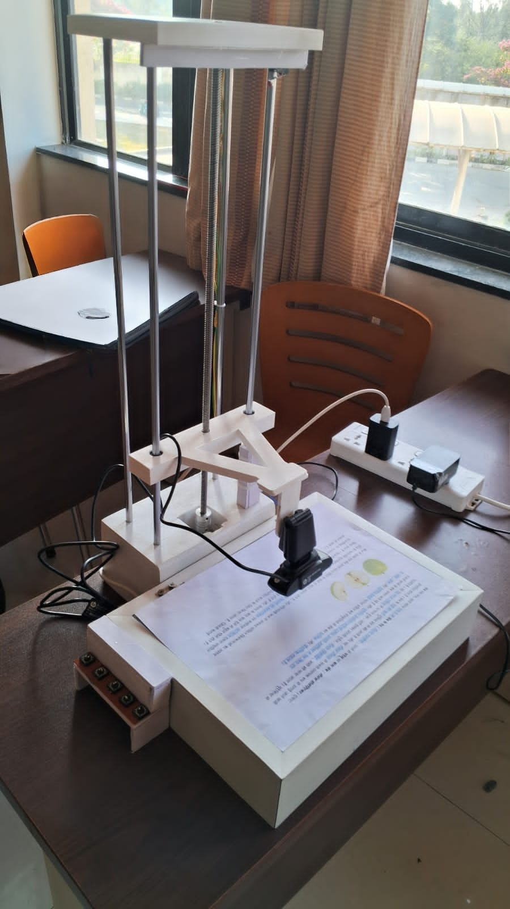
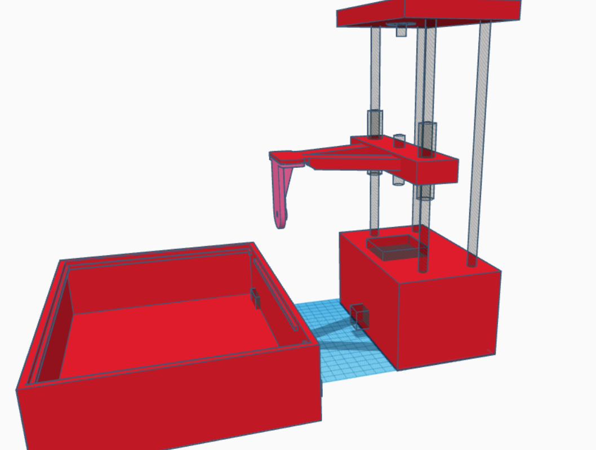

# Vision Assistant

Vision Assistant is an assistive-technology prototype that helps visually impaired users read printed documents. It combines image capture, object detection, OCR, translation and text-to-speech into a compact hardware setup consisting of a Raspberry Pi, an Arduino-controlled stepper mechanism, and a laptop/server for heavy image processing.

This repository contains the software pieces and documentation needed to reproduce and extend the system.

Key features
- Automated paper detection and capture
- Tesseract OCR for text extraction
- YOLOv8 object/figure detection for identifying diagrams and figures
- Multi-language translation and audio output (Hindi, English, Kannada, Tamil, Telugu)
- Braille-button hardware interface for simple tactile language selection

Repository layout

- `raspberry_pi/` – Raspberry Pi client: camera capture, serial control of Arduino, braille button input, translation and TTS. See `raspberry_pi/requirements.txt` for dependencies.
- `Server/` – Processing server (laptop): receives images over TCP, runs preprocessing, Tesseract OCR and YOLOv8 detection, and returns structured JSON results. See `Server/requirements.txt`.
- `Arduino/` – Arduino sketch for motor control and limit-switch handling.
- `README.md` – this file (project overview, setup, architecture and usage notes).

Architecture overview

1. Raspberry Pi (client)
   - Controls the capture workflow and hardware (camera, braille buttons).
   - Serial master for Arduino: sends commands (Move upwards, A4/A5, CaptureComplete) and reads status messages.
   - Sends captured images to the Server over TCP and receives processed results.
   - Translates OCR output into a selected language and plays audio via TTS.

2. Arduino Uno (firmware)
   - Drives the stepper motor to align/capture paper and reads limit switches for homing and safety.
   - Implements a simple, human-readable serial protocol for coordination with the Pi.

3. Server (laptop)
   - Performs computationally intensive tasks: image preprocessing, OCR (Tesseract) and object detection (YOLOv8).
   - Returns results as a JSON payload containing extracted text and detected objects.

Communication and data formats

- Serial (Pi ⇄ Arduino): ASCII commands terminated by newline. Example commands from Pi: `Move upwards`, `A4`, `CaptureComplete`. Arduino replies with human-readable status messages. Improve robustness by adding explicit ACK/NAK and timeouts when deploying.
- TCP (Pi → Server): length-prefixed image upload. Client sends the ASCII file length, waits for an acknowledgement, then streams the raw JPEG bytes.
- TCP (Server → Pi): length-prefixed JSON response. Example JSON payload:

```json
{
  "text": "Extracted OCR text here...",
  "objects": [
    {"label": "figure", "confidence": 0.92, "coordinates": {"x1": 10, "y1": 20, "x2": 200, "y2": 300}},
    ...
  ]
}
```

Hardware components

- Raspberry Pi 4 (or similar): camera host, GPIO for braille buttons, USB serial to Arduino.
- Webcam / Pi Camera: captures document images.
- Arduino Uno + A4988 (or similar stepper driver): runs the stepper motor to position the camera/platform.
- NEMA 17 stepper motor: vertical motion for scanning.
- Limit switches (top/bottom): safety/home switches wired to Arduino inputs.
- Braille-labelled physical buttons: wired to Pi GPIO for language selection.

Images

Below are the project images included in this repository. They are stored at the repository root and displayed here for convenience.

Hardware prototype



CAD design (mechanical)




Quick setup (developer/lab)

Server (Windows laptop)
1. Install Python 3.9+ and create a virtual environment:

```powershell
python -m venv .venv
.\.venv\Scripts\Activate.ps1
pip install -r Server\requirements.txt
```

2. Install Tesseract OCR for Windows and ensure the path in `Server/server1.py` points to `tesseract.exe`.
3. Place the YOLO model (for example `yolov8m.pt`) in `Server/` or update `Server/server1.py` MODEL_PATH.
4. Run the server:

```powershell
python Server\server1.py
```

Raspberry Pi (raspberry_pi)
1. On the Pi, create a Python virtual environment and install dependencies:

```bash
python3 -m venv .venv
source .venv/bin/activate
pip install -r raspberry_pi/requirements.txt
```

2. Wire the hardware:
   - USB connection from Arduino to Pi for serial (the Pi uses `/dev/ttyACM0` by default).
   - Camera to USB or CSI port.
   - Braille buttons to GPIO pins (see `raspberry_pi/client1.py` for pin assignments).
   - Stepper driver wiring to Arduino pins (if using A4988, wire STEP and DIR to two Arduino digital pins and set driver microstepping/SLEEP/ENABLE appropriately).

3. Update `raspberry_pi/client1.py` configuration constants (`SERVER_IP`, serial port path, and file paths) as necessary.
4. Run the client (use a virtual display or enable headless mode if running without X):

```bash
python3 raspberry_pi/client1.py
```

Important deployment notes

- Headless operation: `cv2.imshow()` calls require an X display; for headless Pi set a headless flag in the client or use a virtual framebuffer (`xvfb`) to preview images.
- Offline operation: translation (`deep-translator`) and gTTS require network access. For fully offline audio use `espeak` or `pyttsx3`.
- Arduino driver: the stock Arduino sketch uses the `Stepper` library. If your build uses an A4988 (STEP/DIR) driver, replace the stepper logic with pulse-based STEP/DIR toggling to match the driver wiring and microstepping configuration.
- Security: current TCP protocol is plaintext. For deployment across untrusted networks, tunnel the TCP connection over SSH or use TLS.

Recommended improvements (short list)

- Replace SSIM-based paper-size detection with contour-based page detection and aspect-ratio checks for robust results.
- Add ACK/timeout/retry to the serial protocol for robust hardware coordination.
- Provide a small integration test that uploads a sample image to the Server and asserts the JSON structure.
- Add wiring diagrams and a photo of the assembled prototype in the repository for clarity.

Contributing

Contributions, bug reports and pull requests are welcome. Please open issues for feature requests or problems you encounter and include hardware details if filing hardware-related issues.

License

Include your preferred license here (for example MIT). If you want, I can add a `LICENSE` file.
